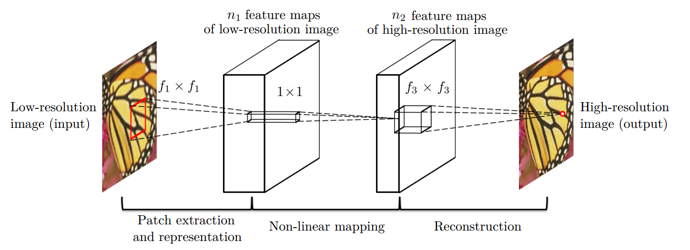

# SRCNN-Pytorch
SRCNN-Pytorch
Pytorch implementation of Convolutional Neural Networks for super-resolution.

The original paper: 
[Learning a Deep Convolutional Network for
Image Super-Resolution](https://link.springer.com/chapter/10.1007/978-3-319-10593-2_13)

***Usage***

Edit config.yaml

for training: is_train = True

for evaluation: is_train = False